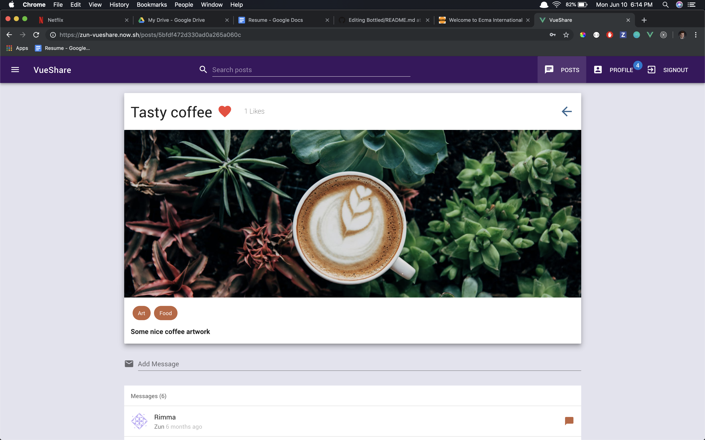
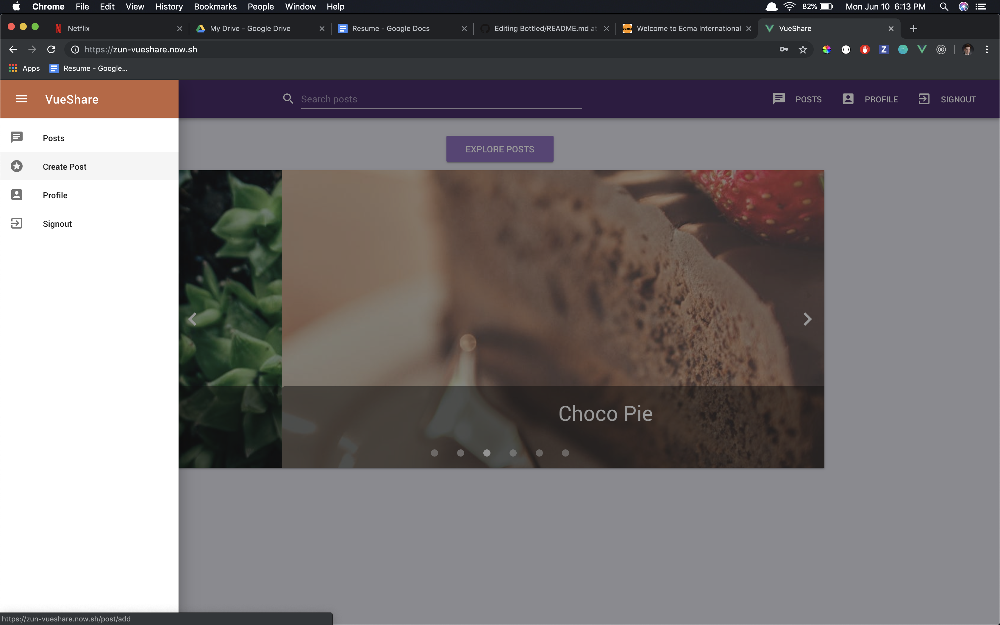
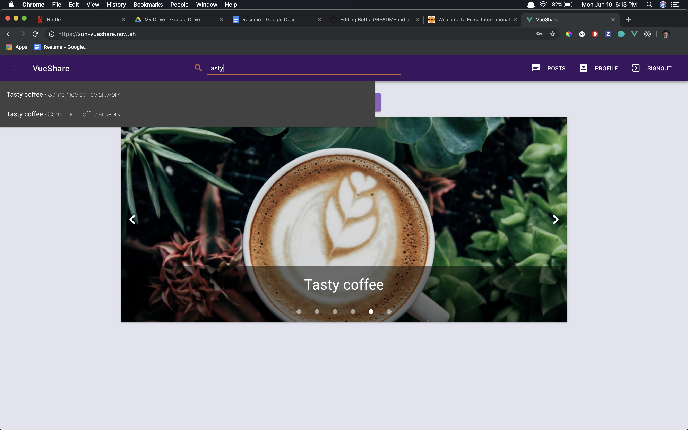
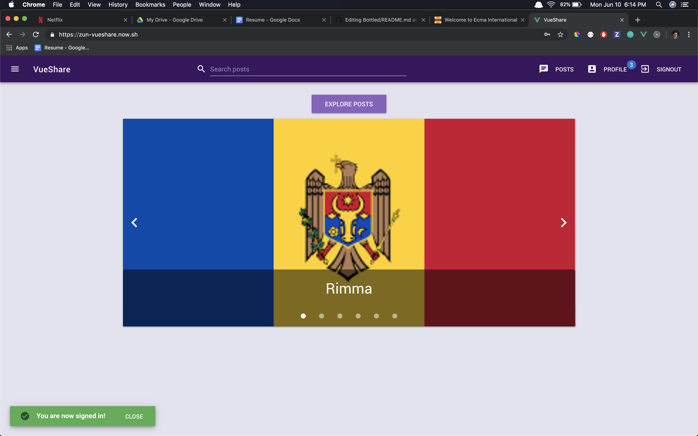
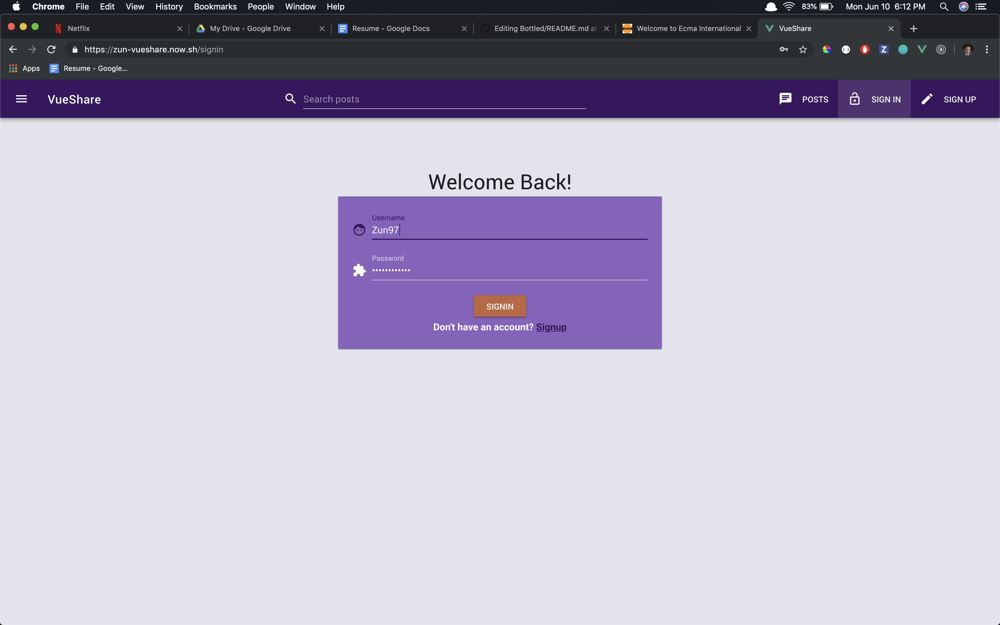
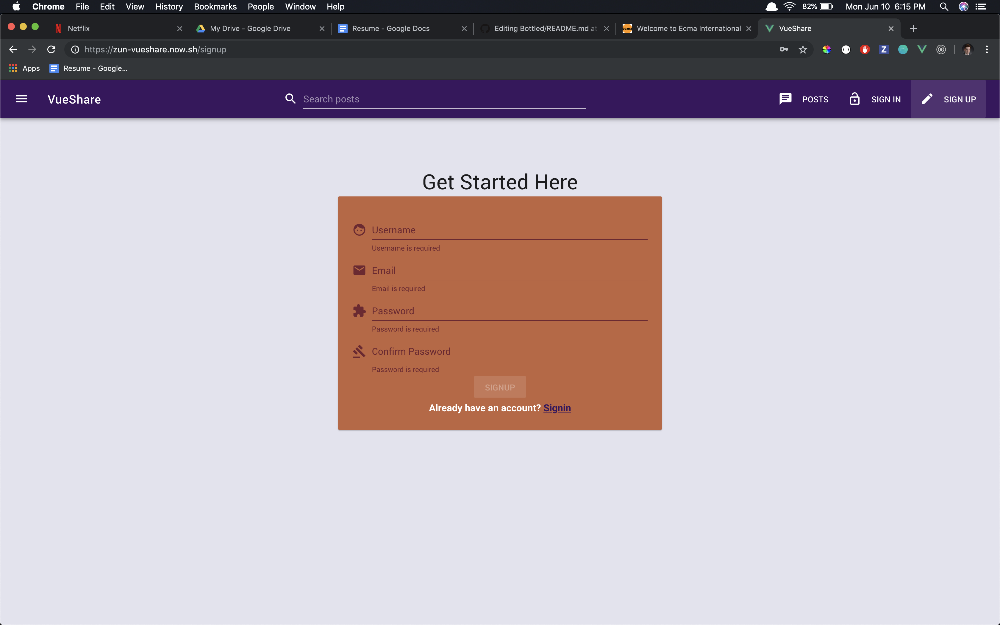
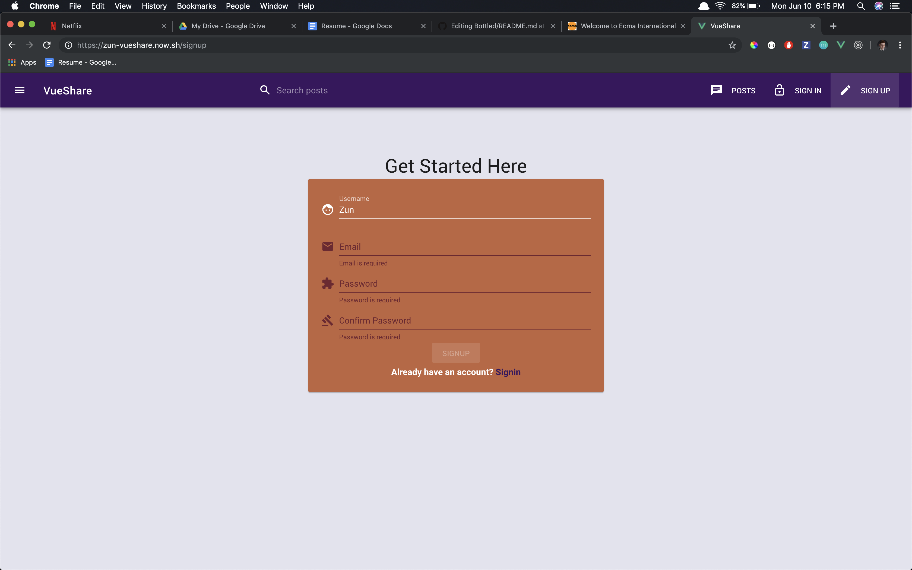

# VueShare

A social media site similar to Pinterest and Instagram which was built using Vue, Apollo and GraphQL.

## [Deployed Here](https://zun-vueshare.now.sh/)

## Built With
- [Apollo](https://www.apollographql.com/) - Both the server and http client enabling the use of a GraphQL API
- [Vue](https://vuejs.org/) - Front-End Framework
- [Vuetify](https://vuetifyjs.com/en/) - Front-End CSS Framework
- [Mongoose](https://mongoosejs.com/) - Database ORM 
- [MongoDB](https://www.mongodb.com/) - Database
- [GraphQL](https://graphql.org/) - Back-End Query Language
- [Now.sh](https://zeit.co/now) - Deployment
- [Node.js](https://nodejs.org/en/) - Back-End runtime environment for JavaScript
- [Babel](https://babeljs.io/) - Transpiler for JavaScript
- [ESNEXT](https://www.ecma-international.org/) - Next generation JavaScript code

## Authors
- **Sam G Zun** - [SZun](https://github.com/SZun)
